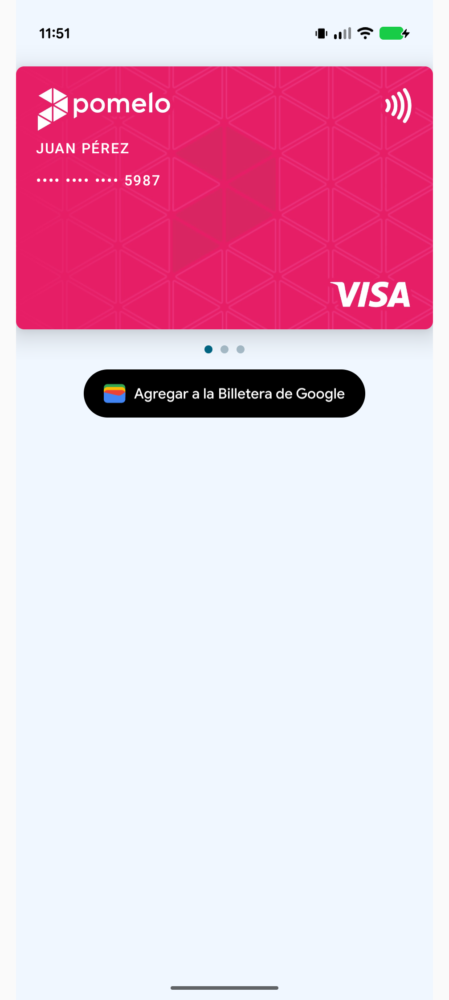
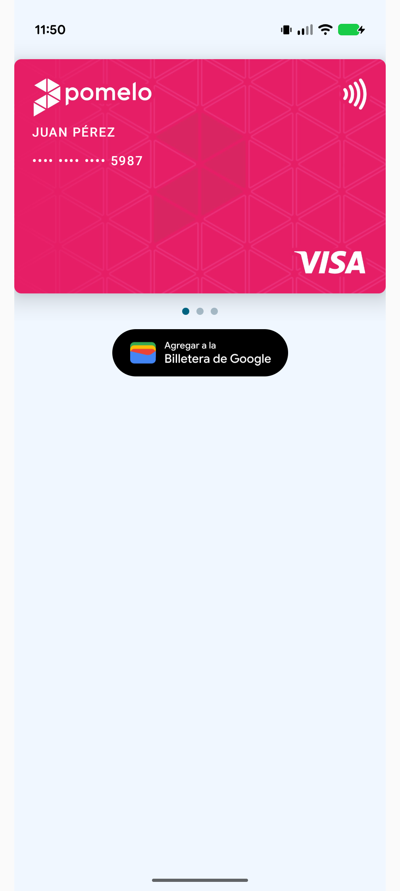
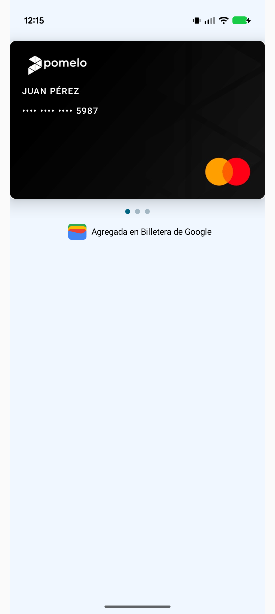
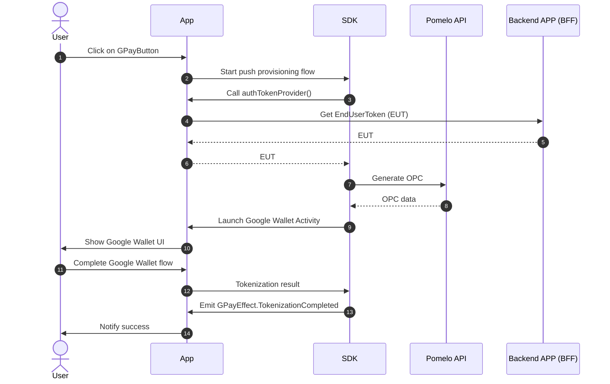
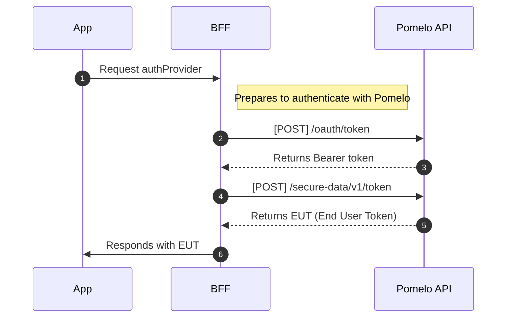

# Pomelo SDK: Push Provisioning

El módulo **pushprovisioning** es una biblioteca de Android SDK desarrollada por Pomelo que permite integrar la funcionalidad de **Push Provisioning** de Google Pay en aplicaciones Android.

Construido sobre el **Google Pay TapAndPay SDK**, ofrece **UI Components** pre-diseñados para Jetpack Compose que facilitan la integración. El módulo incluye **soporte multi-red** para Visa y Mastercard, proporcionando una experiencia de usuario fluida y segura para la tokenización
automática de tarjetas.

<div align="center">

|          Botón Normal          |          Badge Compacto           |               Ya en Wallet                |               Demo                |
|:------------------------------:|:---------------------------------:|:-----------------------------------------:|:---------------------------------:|
|  |  |  | <video src="https://github.com/user-attachments/assets/b058c0a0-1e81-4f65-830e-f7af2a644694" height="400" controls></video> |

</div>

## Requisitos

- **Android SDK mínimo**: 21 (Android 5.0 Lollipop)
- **Android SDK Target**: 34 (Android 14)
- **SDK Compile**: 35 (Android 15)
- **Kotlin**: Compatible con versión 2.0.20+
- **Gradle**: Versión 8.6+
- **Java Version**: 1.8

### Permisos Requeridos


```xml
<uses-permission android:name="android.permission.INTERNET" />
<uses-permission android:name="android.permission.ACCESS_NETWORK_STATE" />
```


## Instalación y uso básico

> [!WARNING]
> Antes de realizar cualquier integración en su app, es necesario completar el proceso de alta con Google. Puede leer más información en [Pomelo Docs](https://docs.pomelo.la/docs/cards/features/tokenization/google-pay/) y  [Push Provisioning API Access](https://developers.google.com/pay/issuers/apis/push-provisioning/android/allowlist) de Google. Si no se realiza correctamente este proceso, al inicializar el SDK obtendrán un error `TAP_AND_PAY_UNAVAILABLE`


### Resolución de dependencias


Descargue el SDK de TapAndPay ([Guia](https://developers.google.com/pay/issuers/apis/push-provisioning/android/setup)) y el SDK de Pomelo y descomprima ambos dentro del un mismo directorio. Por ejemplo dentro de `${rootDir}/app/libs/`.


1. Agregue la configuración para que Maven pueda resolver las dependencias correctamente.

```groovy
dependencyResolutionManagement {
    repositoriesMode.set(RepositoriesMode.FAIL_ON_PROJECT_REPOS)
    repositories {
        maven { url "file://${rootDir}/app/libs/" }
        google()
        mavenCentral()

    }
}
```

2. Declare las dependencias.

```groovy
dependencies {
  implementation 'com.google.android.gms:play-services-tapandpay:18.3.3'
  implementation 'com.pomelo:push-provisioning:1.0.39-develop'
}
```


### Inicializar en la Application


```kotlin
class MyApplication : Application() {
    override fun onCreate() {
        super.onCreate()
      
        // Registrar el SDK
        PomeloPushProvisioning.register(
            context = this, 
            environment = PomeloEnvironment.STAGE,
            enableLogging = true
        )
    }
}
```


### Implementar Autenticación


```kotlin
class AuthTokenProvider {
  suspend fun getToken(): String {
    return try {
      // Llamar a tu API para obtener el End User Token
      authApiService.getAuthToken().token
    } catch (e: Exception) {
      throw AuthenticationException("Error obteniendo token: ${e.message}")
    }
  }
}
```


### Integrar el Composable


```kotlin
@Composable
fun MyCardScreen(viewModel: HomeViewModel = viewModel()) {
  var isGPayLoading by remember { mutableStateOf(false) }

  Column(modifier = Modifier.padding(16.dp)) {
    GoogleWalletButtonComposable(
        cardId = "crd-123",
        lastFour = "1234",
        brand = Brand.VISA,
        asBadge = false,
        authTokenProvider = { viewModel.getAuthToken("usr-123") },
        onEffect = { effect ->
          when (effect) {
            GWalletEffect.Loading -> {
              isGPayLoading = true
            }

            is GWalletEffect.Error -> {
              isGPayLoading = false
              val errorMessage =
                  when (effect.errorType) {
                    ErrorType.USER_CANCELLED -> "Usuario canceló la operación"
                    ErrorType.AUTHENTICATION_FAILED -> "Error de autenticación. Intenta nuevamente."
                    ErrorType.TAP_AND_PAY_SDK -> "Error de Google Pay. Verifica que esté instalado."
                    ErrorType.OPC_GENERATION_FAILED -> "Error del servidor. Intenta más tarde."
                    ErrorType.UNKNOWN_ERROR -> "Error: ${effect.message}"
                  }

              showErrorSnackbar(errorMessage)
            }

            GWalletEffect.TokenizationCompleted -> {
              isGPayLoading = false
              showSuccessSnackbar("¡Tarjeta agregada exitosamente a Google Wallet!")
            }
          }
        },
    )
  }
}
```


## Documentación de API



### Parámetros de Inicialización


```kotlin
PomeloPushProvisioning.register(
    context = this, 
    environment = environment,
    enableLogging = false 
)
```


| Parámetro       | Tipo                | Requerido | Default                        | Descripción                               |
| --------------- | ------------------- | --------- | ------------------------------ | ----------------------------------------- |
| `context`       | `Context`           | ✅         | -                              | Contexto de la aplicación                 |
| `environment`   | `PomeloEnvironment` | ❌         | `PomeloEnvironment.PRODUCTION` | Ambiente del API (STAGE o PRODUCTION)     |
| `enableLogging` | `Boolean`           | ❌         | `false`                        | Habilita logs para desarrollo y debugging |


### Composable Principal: `PomeloEnvironment`


| Environment                    | URL                          |
| ------------------------------ | ---------------------------- |
| `PomeloEnvironment.STAGE`      | https://api-stage.pomelo.la/ |
| `PomeloEnvironment.PRODUCTION` | https://api.pomelo.la/       |


### Composable Principal: `GPayButtonComposable`


```kotlin
@Composable
fun GPayButtonComposable(
    cardId: String,
    lastFour: String,
    brand: Brand,
    authTokenProvider: suspend () -> String,
    modifier: Modifier = Modifier,
    asBadge: Boolean = false,
    onEffect: (GPayEffect) -> Unit = {},
    alreadyInWalletComposable: (@Composable () -> Unit)? = null,
)
```


**Parámetros**:


| Parámetro                   | Tipo                        | Requerido | Default    | Descripción                                                                  |
| --------------------------- | --------------------------- | --------- | ---------- | ---------------------------------------------------------------------------- |
| `cardId`                    | `String`                    | ✅         | -          | Identificador único de la tarjeta en el sistema Pomelo                       |
| `lastFour`                  | `String`                    | ✅         | -          | Últimos 4 dígitos de la tarjeta                                              |
| `brand`                     | `Brand`                     | ✅         | -          | Red de la tarjeta (VISA o MASTERCARD)                                        |
| `authTokenProvider`         | `suspend () -> String`      | ✅         | -          | Función suspendida que provee el token de autenticación                      |
| `modifier`                  | `Modifier`                  | ❌         | `Modifier` | Modificadores de Compose para personalización                                |
| `asBadge`                   | `Boolean`                   | ❌         | `false`    | Si mostrar como badge o botón completo                                       |
| `onEffect`                  | `(GPayEffect) -> Unit`      | ❌         | `{}`       | Callback para manejar efectos del componente                                 |
| `alreadyInWalletComposable` | `(@Composable () -> Unit)?` | ❌         | `null`     | Composable personalizado para mostrar cuando la tarjeta ya está en la wallet |


### Efectos: `GPayEffect`


```kotlin
sealed class GPayEffect {
  object Loading : GPayEffect()
  object TokenizationCompleted : GPayEffect()
  data class Error(val errorType: ErrorType, val message: String, val throwable: Throwable? = null) : GPayEffect()
}
```


### Tipos de Error: `ErrorType`


```kotlin
enum class ErrorType {
    USER_CANCELLED,       
    TAP_AND_PAY_SDK,     
    AUTHENTICATION_FAILED,
    OPC_GENERATION_FAILED,
    UNKNOWN_ERROR,       
}
```


### Red de Tarjetas: `Brand`


```kotlin
@Immutable
enum class Brand(val tsp: Int, val network: Int) {
    VISA(TapAndPay.TOKEN_PROVIDER_VISA, TapAndPay.CARD_NETWORK_VISA),
    MASTERCARD(TapAndPay.TOKEN_PROVIDER_MASTERCARD, TapAndPay.CARD_NETWORK_MASTERCARD)
}
```


## Detalle de Errores


### `ErrorType`


| Tipo de Error           | Descripción                                                                          |
| ----------------------- | ------------------------------------------------------------------------------------ |
| `USER_CANCELLED`        | El usuario canceló el proceso de tokenización en Google Wallet                       |
| `TAP_AND_PAY_SDK`       | Error interno del SDK de Google Pay o problema con la configuración de Google Wallet |
| `AUTHENTICATION_FAILED` | Error en el método `authTokenProvider`                                               |
| `OPC_GENERATION_FAILED` | Error al momento de generar los criptogramas                                         |
| `UNKNOWN_ERROR`         | Error inesperado o caso no contemplado en el flujo normal                            |


### TapAndPay Status Codes


| Código                            | Valor | Descripción                                                                           |
| --------------------------------- | ----- | ------------------------------------------------------------------------------------- |
| `TAP_AND_PAY_NO_ACTIVE_WALLET`    | 15002 | No hay una wallet activa en el dispositivo                                            |
| `TAP_AND_PAY_TOKEN_NOT_FOUND`     | 15003 | El token especificado no se encuentra en la wallet activa                             |
| `TAP_AND_PAY_INVALID_TOKEN_STATE` | 15004 | El token existe pero no está en un estado válido para la operación                    |
| `TAP_AND_PAY_ATTESTATION_ERROR`   | 15005 | La tokenización falló porque el dispositivo no pasó la verificación de compatibilidad |
| `TAP_AND_PAY_UNAVAILABLE`         | 15009 | La API de TapAndPay no está disponible para esta aplicación                           |
|                                   |       |                                                                                       |


## Flujo de autenticación


Por motivos de seguridad, la generación del EUT (End User Token) debe realizarse en un servidor backend y no directamente en el dispositivo móvil. Esto evita exponer credenciales privadas en la
aplicación cliente.


El flujo de autenticación sigue estos pasos:

1. **La aplicación solicita autenticación**: Cuando el usuario intenta agregar una tarjeta a Google Wallet, la app solicita un token al BFF (Backend for Frontend)
2. **El BFF se autentica con Pomelo**: El servidor backend utiliza sus credenciales para obtener un Bearer token de la API de Pomelo
3. **Generación segura del EUT**: Con el Bearer token, el BFF solicita la generación del EUT, que contiene los datos cifrados necesarios para la tokenización
4. **Retorno seguro a la app**: El EUT se envía de forma segura a la aplicación móvil para completar el proceso de tokenización



### Control de Logs

> [!CAUTION]
> Nunca habilites logs en producción ya que pueden exponer información sensible. Los logs están sanitizados pero es una buena práctica mantenerlos deshabilitados en producción.

> [!TIP]
> Por defecto los logs del SDK de TapAndPay vienen ofuscados, es recomendable solicitar los accesos a Google para facilitar el debugging. [Formulario de acceso.](https://developers.google.com/pay/issuers/apis/push-provisioning/android/support/troubleshooting#enable_logs_for_user)


Por razones de **seguridad**, los logs están **deshabilitados por defecto**.


**¿Qué información se loggea cuando está habilitado?**
- Estados del flujo de tokenización
- Respuestas de API (sanitizadas)
- Logs de red HTTP (sanitizados)
- Errores y excepciones
- **Información sensible siempre sanitizada**: IDs de tarjetas, tokens, números de tarjeta se muestran como `***`


### Debugging Avanzado con Tags Categorizados


El SDK usa **tags categorizados** para facilitar el debugging específico por componente:


**Formato de Tags:**
- **Base**: `PushProvisioning` (logs generales)
- **ViewModel**: `PushProvisioning:ViewModel` (lógica de negocio)
- **HTTP**: `PushProvisioning:HTTP` (requests/responses de red)
- **Composable**: `PushProvisioning:Composable` (UI y estados)


**Comandos de Filtrado con ADB:**


```bash
# Todos los logs del SDK
adb logcat -s "PushProvisioning*"

# Solo logs del ViewModel (lógica de tokenización)
adb logcat -s "PushProvisioning:ViewModel"

# Solo logs de red HTTP (requests/responses)
adb logcat -s "PushProvisioning:HTTP" 

# Solo logs de UI (estados del composable)
adb logcat -s "PushProvisioning:Composable"

# Combinación de categorías específicas
adb logcat -s "PushProvisioning:ViewModel" -s "PushProvisioning:HTTP"

# Logs con nivel específico
adb logcat PushProvisioning:ViewModel:D *:S  # Solo DEBUG del ViewModel
```

