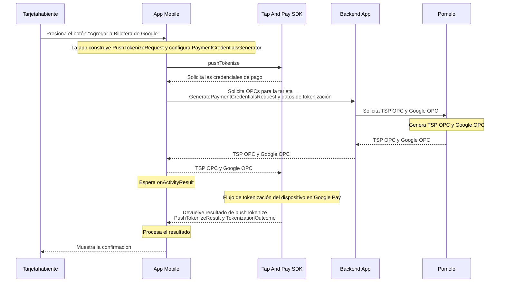
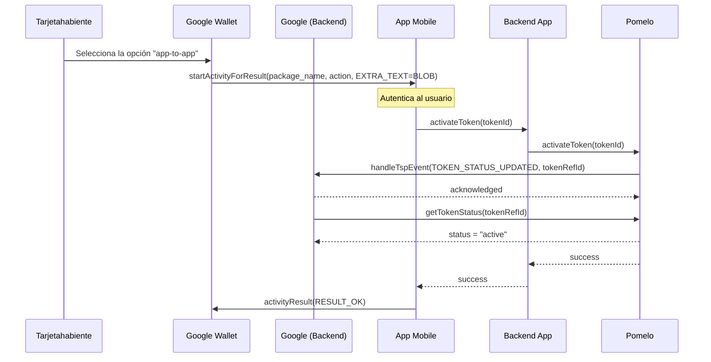

# Ejemplo de integracion con Google UPP

> [!IMPORTANT]
> Este repositorio contiene un ejemplo basico de una integracion con Google Tap And Pay SDK.
> Usalo solo como muestra de referencia y valida siempre los detalles de implementacion con la documentacion oficial provista por Google.
> Bajo ninguna circunstancia deberia usarse el codigo de este repositorio en produccion.

Este ejemplo se divide en dos partes:

- [`app/`](app/README.md): aplicacion de ejemplo para Android que integra Google Tap And Pay Push Provisioning y lanza el flujo de Google Wallet.
- [`backend-app/`](backend-app/README.md): backend de ejemplo en Node.js/TypeScript que expone los endpoints de tarjeta, usuario y push provisioning consumidos por la app Android.

## Estructura del repositorio

```text
example-android-app-google-upp/
├── app/
└── backend-app/
```

## Como esta organizado el ejemplo

Este ejemplo cubre dos flujos independientes de Google Wallet:

1. **Push provisioning manual** (Visa y Mastercard): el usuario toca "Agregar a Billetera de Google" dentro de la app.
2. **App2App / IDV** ("yellow path", solo Visa): Google Wallet invoca la app para verificar la identidad del cardholder y activar un token existente.

La app Android demuestra la integracion de Tap And Pay del lado cliente:

- renderizar el boton oficial de Google Wallet
- verificar el estado de tokenizacion
- lanzar `pushTokenize(...)`
- generar credenciales de pago mediante `PomeloCredentialsGenerator`
- manejar el resultado devuelto por Google Wallet
- recibir el Intent de App2App de Google Wallet, autenticar al cardholder (`BiometricPrompt`) y confirmar la activacion del token

La app backend demuestra la parte del servidor requerida por el ejemplo:

- exponer endpoints de consulta de tarjeta y usuario
- exponer endpoints de push provisioning para Mastercard y Visa
- hacer proxy de la solicitud de provisioning hacia Pomelo y devolver datos OPC al flujo cliente
- hacer proxy de la activacion de token App2App hacia Pomelo (Visa)

## Diagrama de secuencia: Push Provisioning


## Diagrama de secuencia: App2App (IDV) para Visa

Referencia oficial: [App-to-app verification](https://developers.google.com/pay/issuers/tsp-integration/app-to-app-idv) (Google). Diagrama de arquitectura de esa misma página, adaptado con los nombres de este ejemplo.

> [!IMPORTANT]
> Este flujo es independiente del push provisioning manual de arriba: acá Google Wallet inicia el Intent, no la app, y en ningún momento se llama al SDK Tap And Pay.

Incluye también la parte que no vemos ni implementamos nosotros: el handshake interno entre Google y Pomelo (como TSP) que ocurre por detrás de nuestras dos llamadas (`App Mobile -> Backend App` y `Backend App -> Pomelo`). El detalle puntual de nuestra implementación (intent-filter, payload de Visa, `BiometricPrompt`, `STEP_UP_RESPONSE`) está en [`app/README.md`](app/README.md#app2app-idv-para-visa).



## Segui leyendo

- Para el flujo Android, los diagramas y las referencias del SDK, mira [`app/README.md`](app/README.md).
- Para los endpoints backend, las variables de entorno y las instrucciones de ejecucion local, mira [`backend-app/README.md`](backend-app/README.md).
