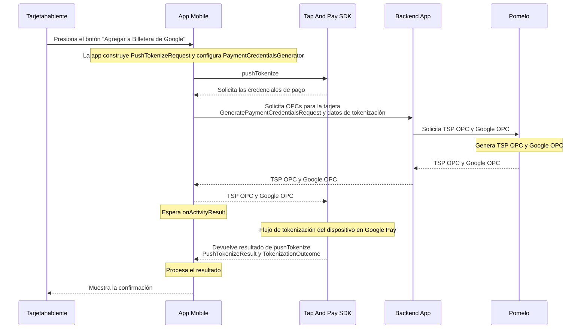
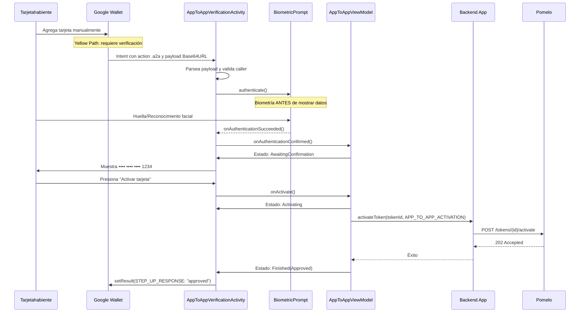

# Ejemplo de integracion con Google UPP

> [!IMPORTANT]
> Este repositorio contiene un ejemplo basico de una integracion con Google Tap And Pay SDK.
> Usalo solo como muestra de referencia y valida siempre los detalles de implementacion con la documentacion oficial provista por Google.
> Bajo ninguna circunstancia deberia usarse el codigo de este repositorio en produccion.

Este ejemplo se divide en dos partes:

- [`app/`](app/README.md): aplicacion de ejemplo para Android que integra Google Tap And Pay Push Provisioning y lanza el flujo de Google Wallet.
- [`backend-app/`](backend-app/README.md): backend de ejemplo en Node.js/TypeScript que expone los endpoints de tarjeta, usuario y push provisioning consumidos por la app Android.

## Estructura del repositorio

```text
example-android-app-google-upp/
├── app/
└── backend-app/
```

## Como esta organizado el ejemplo

La app Android demuestra la integracion de Tap And Pay del lado cliente:

- renderizar el boton oficial de Google Wallet
- verificar el estado de tokenizacion
- lanzar `pushTokenize(...)`
- generar credenciales de pago mediante `PomeloCredentialsGenerator`
- manejar el resultado devuelto por Google Wallet
- soportar Bounce Provisioning, para que Google Wallet pueda redirigir al usuario a esta app y agregar la tarjeta sin navegacion adicional
- soportar App-to-App Verification (A2A) para el flujo Yellow Path de Google Wallet, con autenticación biométrica antes de mostrar cualquier dato de la tarjeta

La app backend demuestra la parte del servidor requerida por el ejemplo:

- exponer endpoints de consulta de tarjeta y usuario
- exponer endpoints de push provisioning para Mastercard y Visa
- hacer proxy de la solicitud de provisioning hacia Pomelo y devolver datos OPC al flujo cliente
- exponer el endpoint de activacion de token consumido por el flujo A2A tras la verificacion biometrica

## Diagrama de secuencia: Push Provisioning

Este es el flujo principal, disparado por el usuario desde la app al presionar "Agregar a Billetera de Google" (incluye tambien la variante Bounce Provisioning, donde Google Wallet es quien lanza la app).



## Diagrama de secuencia: App-to-App Verification (A2A)

Este es un flujo distinto e independiente del anterior: no lo inicia el usuario desde esta app, sino que Google Wallet lanza esta app cuando necesita verificar la identidad del titular antes de activar un token (Yellow Path), en lugar de enviar un OTP por SMS/email.



Para el detalle completo de este flujo (biometria, manejo de cancelacion/error, formato del payload de Visa) mira la seccion [App-to-App Verification (A2A)](app/README.md#app-to-app-verification-a2a) en `app/README.md`.

## Segui leyendo

- Para el flujo Android, los diagramas y las referencias del SDK, mira [`app/README.md`](app/README.md).
- Para los endpoints backend, las variables de entorno y las instrucciones de ejecucion local, mira [`backend-app/README.md`](backend-app/README.md).
