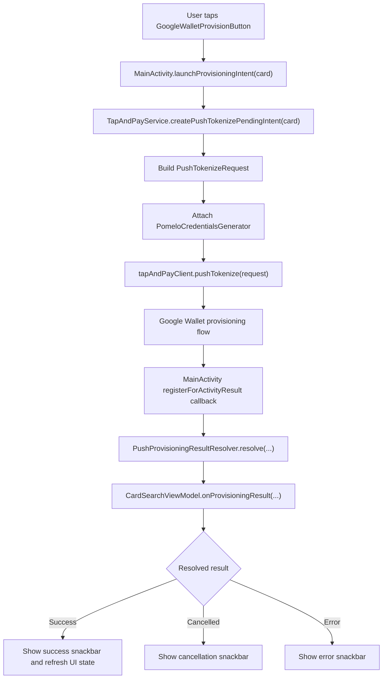
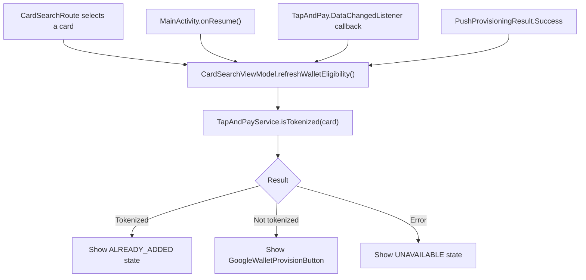
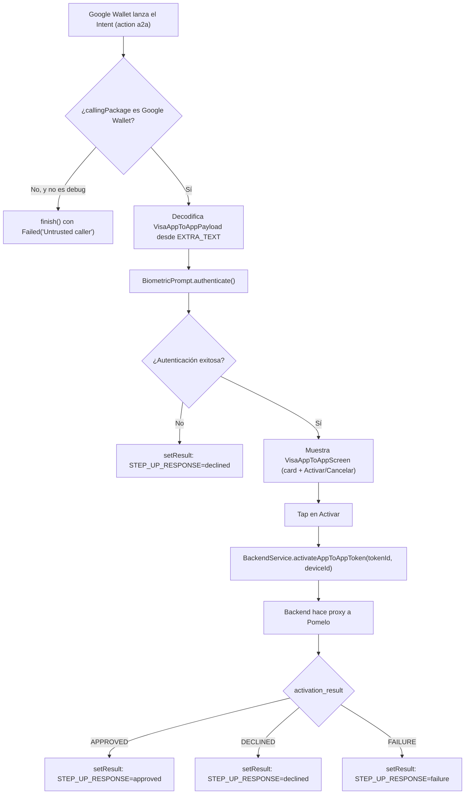

# Ejemplo de app Android con Google UPP

> [!IMPORTANT]
> Este repositorio contiene un ejemplo basico de una integracion con Google Tap And Pay SDK.
> Usalo solo como muestra de referencia y valida siempre los detalles de implementacion con la
> documentacion oficial provista por Google.
> Bajo ninguna circunstancia deberia usarse el codigo de este repositorio en produccion.


Esta carpeta contiene una app Android de ejemplo que demuestra una integracion con Google Tap And
Pay. Cubre dos flujos independientes:

- **Push Provisioning (manual)**: la app inicia el flujo — renderiza el boton oficial de Google
  Wallet, verifica el estado de tokenizacion, lanza `pushTokenize(...)`, genera credenciales de
  Pomelo y resuelve el resultado devuelto por Google Wallet.
- **App2App (IDV) para Visa**: Google Wallet inicia el flujo — invoca la app para verificar la
  identidad del cardholder y activar un token existente. No usa el SDK Tap And Pay.

## Push Provisioning (manual)

La app inicia este flujo tocando el boton de Google Wallet; no tiene relacion con App2App (seccion
siguiente).

### GoogleWalletProvisionButton

[GoogleWalletProvisionButton.kt](app/src/main/java/com/example/example_google_upp/components/GoogleWalletProvisionButton.kt)
es el punto de entrada en Compose para renderizar el boton oficial "Add to Google Wallet".

La app usa la Provision Button API con integracion programatica mediante `ProvisionButton`. Esto
evita mantener assets estaticos del boton y le permite al SDK encargarse del branding, la
localizacion y el escalado. La API soporta dos modos de visualizacion:
`PROVISION_BUTTON_DISPLAY_MODE_PRIMARY` y `PROVISION_BUTTON_DISPLAY_MODE_CONDENSED`; este ejemplo
usa `PRIMARY`.

Referencia
oficial: [Provision Button API](https://developers.google.com/pay/issuers/apis/push-provisioning/android/provision-button-api)

### MainActivity

[MainActivity.kt](app/src/main/java/com/example/example_google_upp/MainActivity.kt) conecta la UI de
Compose con el flujo de Tap And Pay. Sus responsabilidades son:

- Registrar `registerForActivityResult(...)` para escuchar el resultado de la Activity de Google
  Wallet.
- Registrar `TapAndPay.DataChangedListener` para refrescar el estado local cuando cambia Wallet.
- Revalidar elegibilidad en `onResume`, porque el estado de Wallet puede cambiar fuera de la app.
- Solicitar el `PendingIntent` de push tokenization y lanzarlo con `IntentSenderRequest`.
- Delegar la interpretacion del resultado en `PushProvisioningResultResolver`.

Referencias oficiales:

- [Handling result callbacks](https://developers.google.com/pay/issuers/apis/push-provisioning/android/wallet-operations#handling_result_callbacks)
- [Data Change Callbacks](https://developers.google.com/pay/issuers/apis/push-provisioning/android/reading-wallet#data_change_callbacks)



### CardSearchViewModel.refreshWalletEligibility

[CardSearchViewModel.kt](app/src/main/java/com/example/example_google_upp/ui/CardSearchViewModel.kt)
maneja el estado de UI de la tarjeta seleccionada.

`refreshWalletEligibility()` sincroniza el estado del boton de Google Wallet. Se llama despues de
eventos relevantes para Wallet como `onResume`, los callbacks de `DataChangedListener` y un
provisioning exitoso. La funcion cancela cualquier verificacion previa, llama a
`walletProvisioningGateway.isTokenized(card)` y mapea el resultado a la UI:

- `isTokenized == true` -> `WalletButtonState.ALREADY_ADDED`
- `isTokenized == false` -> `WalletButtonState.READY_TO_ADD`
- error al verificar Tap And Pay -> `WalletButtonState.UNAVAILABLE`

La documentacion de Tap And Pay recomienda actualizar la UI cuando la Activity vuelve al foreground
y cuando llega un callback de cambio de datos.



### TapAndPayService

[TapAndPayService.kt](app/src/main/java/com/example/example_google_upp/wallet/TapAndPayService.kt)
es la puerta de entrada de la app hacia `TapAndPayClient` y el backend emisor.

`isTokenized(card)` construye un `IsTokenizedRequest` con los ultimos cuatro digitos de la tarjeta,
la red y el token service provider. Devuelve `true` o `false` segun si Tap And Pay encuentra esa
tarjeta tokenizada en Google Wallet del dispositivo actual.

Referencia
oficial: [isTokenized](https://developers.google.com/pay/issuers/apis/push-provisioning/android/reading-wallet#istokenized)

`createPushTokenizePendingIntent(card)` obtiene el usuario desde `BackendService`, construye
`UserAddress`, arma el `PushTokenizeRequest` y llama a `tapAndPayClient.pushTokenize(request)`. La
solicitud pasa `PomeloCredentialsGenerator` como `PaymentCredentialsGenerator`, que es el componente
que Google Wallet invoca cuando necesita credenciales OPC.

Referencia
oficial: [pushTokenize](https://developers.google.com/pay/issuers/apis/push-provisioning/android/wallet-operations#pushtokenize)

### PomeloCredentialsGenerator

[PomeloCredentialsGenerator.kt](app/src/main/java/com/example/example_google_upp/wallet/PomeloCredentialsGenerator.kt)
implementa la interfaz `PaymentCredentialsGenerator` de Tap And Pay.

Su responsabilidad es generar credenciales del emisor cuando Google Wallet llega al paso de push
tokenization que requiere datos OPC. El metodo `generate(request)` recibe un
`GeneratePaymentCredentialsRequest` con contexto provisto por Google:

- `serverSessionId`
- `stableHardwareId`
- `walletId`

La app envia esos valores a Pomelo mediante `BackendService.getProvisioningData(...)` y usa la
respuesta para construir un `GeneratePaymentCredentialsResponse` con:

- `setOpaquePaymentCard(...)`
- `setGoogleOpaquePaymentCard(...)`

La implementacion devuelve un `Future<GeneratePaymentCredentialsResponse>`, tal como espera la
interfaz del SDK.

Referencias oficiales:

- [PaymentCredentialsGenerator interface](https://developers.google.com/pay/issuers/apis/push-provisioning/android/wallet-operations#paymentcredentialsgenerator_interface)
- [GeneratePaymentCredentialsRequest interface](https://developers.google.com/pay/issuers/apis/push-provisioning/android/wallet-operations#generatepaymentcredentialsrequest_interface)
- [GeneratePaymentCredentialsResponse interface](https://developers.google.com/pay/issuers/apis/push-provisioning/android/wallet-operations#generatepaymentcredentialsresponse_interface)

### PushProvisioningResultResolver

[PushProvisioningResultResolver.kt](app/src/main/java/com/example/example_google_upp/wallet/PushProvisioningResultResolver.kt)
traduce el resultado de Google Wallet al modelo interno `PushProvisioningResult`.

`MainActivity` delega en este resolver el `activityResultCode` y el `Intent` recibidos desde Google
Wallet. El resolver lee `TapAndPay.EXTRA_PUSH_TOKENIZE_RESULT` cuando esta disponible y devuelve uno
de tres resultados simples para que el `ViewModel` actualice la UI:

- `Success`: la tokenizacion fue exitosa.
- `Cancelled`: Tap And Pay devolvio un estado de cancelacion, como `TAP_AND_PAY_USER_CANCELED_FLOW`
  o `CANCELED`.
- `Error`: falta el payload de Tap And Pay, faltan los resultados de tokenizacion, fallo el guardado
  de FPAN o se devolvio cualquier otro estado de error.

Este handler es intencionalmente basico para la app de ejemplo: no intenta modelar una UI avanzada
para cada codigo de error, solo distingue entre exito, cancelacion y error.

Referencia
oficial: [Sample code for pushTokenize(...)](https://developers.google.com/pay/issuers/apis/push-provisioning/android/upgrade_to_upp#sample_code_for_pushtokenize)

## App2App (IDV) para Visa

Referencia
oficial: [App-to-app verification](https://developers.google.com/pay/issuers/tsp-integration/app-to-app-idv)

Este flujo es **independiente** del Push Provisioning manual de la sección anterior: no comparten
código ni Activity, y no hay que confundirlos. En vez de que la app inicie el `pushTokenize`, es *
*Google Wallet quien invoca la app** cuando Visa determina que un token necesita verificación de
identidad del cardholder ("yellow path") antes de poder activarlo. La app nunca llama al SDK Tap And
Pay en este flujo: es un handoff de Intent más una llamada HTTP al backend propio.

### Intent-filter

Visa exige que la action del intent-filter tenga el formato fijo
`{banking app identifier}.{service name}`, con `service name` siempre `a2a`. En este ejemplo (
`applicationId = com.example.example_google_upp`) queda declarado en [
`AndroidManifest.xml`](app/src/main/AndroidManifest.xml):

```xml

<activity android:name=".wallet.VisaAppToAppVerificationActivity" android:exported="true">
    <intent-filter>
        <action android:name="com.example.example_google_upp.a2a" />
        <category android:name="android.intent.category.DEFAULT" />
    </intent-filter>
</activity>
```

### VisaAppToAppVerificationActivity

[VisaAppToAppVerificationActivity.kt](app/src/main/java/com/example/example_google_upp/wallet/VisaAppToAppVerificationActivity.kt)
recibe el Intent de Google Wallet. Responsabilidades:

- Validar que el caller sea Google Wallet (`callingPackage == "com.google.android.gms"`), rechazando
  cualquier otro caller.
- Decodificar el payload de `Intent.EXTRA_TEXT` con `VisaAppToAppPayload`.
- Autenticar al cardholder con `BiometricPrompt` antes de mostrar la pantalla de confirmación (ver
  más abajo).
- Reportar el resultado a Google Wallet con `setResult(RESULT_OK, ...)` y el extra
  `STEP_UP_RESPONSE`.

### VisaAppToAppPayload

[VisaAppToAppPayload.kt](app/src/main/java/com/example/example_google_upp/wallet/models/VisaAppToAppPayload.kt)
decodifica el payload opaco que Visa manda en `EXTRA_TEXT`: un JSON codificado en Base64URL con
`panReferenceID`, `tokenRequestorID`, `tokenReferenceID`, `panLast4`, `deviceID` y
`walletAccountID`. Nunca viaja ahí información PCI/de autenticación, por diseño de Google.

### Autenticación del cardholder (BiometricPrompt)

Antes de mostrar la pantalla de confirmación,
`VisaAppToAppVerificationActivity.promptCardholderAuthentication()` pide autenticación con
`BiometricPrompt` (`BIOMETRIC_STRONG`, sumando `DEVICE_CREDENTIAL` desde API 30). Si falla, se
cancela o no hay biometría disponible en el dispositivo, la Activity reporta `declined` a Google
Wallet sin llegar a mostrar la tarjeta.

> [!NOTE]
> Esto es un ejemplo runnable, **no una recomendación**: cada emisor debe elegir la estrategia de
> autenticación que mejor le quede a su propia app (biometría, reconocimiento facial, una sesión ya
> activa, usuario y contraseña, PIN, etc.), no asumir que tiene que ser `BiometricPrompt`.

### VisaAppToAppViewModel y VisaAppToAppScreen

[VisaAppToAppViewModel.kt](app/src/main/java/com/example/example_google_upp/ui/VisaAppToAppViewModel.kt)
mapea el payload decodificado a un `Card` de dominio (usando el mismo fallback `"Pomelo Card"` que
`BackendService` cuando falta el nombre del cardholder, ya que el payload de Visa nunca lo incluye)
y, al confirmar, llama a `BackendService.activateAppToAppToken(tokenId, deviceId)`.

[VisaAppToAppScreen.kt](app/src/main/java/com/example/example_google_upp/ui/VisaAppToAppScreen.kt)
reusa `PomeloCardComposable` para mostrar la tarjeta, con un layout inspirado en el mockup "Issuer
app UI" de la documentación de Google: título de marca, instrucción corta, la tarjeta centrada y un
botón de acción principal pineado abajo.

### Backend y resultado

`BackendService.activateAppToAppToken(...)` llama a `POST tokens/:id/app-to-app-activation` del
backend (ver [`backend-app/README.md`](../backend-app/README.md)), que hace passthrough hacia
Pomelo. La respuesta (`APPROVED`/`DECLINED`/`FAILURE`) se mapea a `AppToAppActivationResult` y, vía
`VisaAppToAppStepUpResponse`, al extra `STEP_UP_RESPONSE` (`approved`/`declined`/`failure`) que se
devuelve a Google Wallet con `setResult(RESULT_OK, ...)`.



### Testing manual con adb

Para simular el Intent de Google Wallet sin depender del flujo real de IDV, se puede armar un
payload mockeado y dispararlo directo:

```bash
# Arma el payload (Base64URL, sin padding necesario)
python3 -c "
import base64, json
payload = {
    'panReferenceID': 'pan-ref-mock-1',
    'tokenRequestorID': 'trid-mock-1',
    'tokenReferenceID': 'token-mock-1',
    'panLast4': '4242',
    'deviceID': 'device-mock-1',
    'walletAccountID': 'wallet-mock-1',
}
print(base64.urlsafe_b64encode(json.dumps(payload).encode()).decode())
"

# Dispara el Intent con el payload generado
adb shell am start -a com.example.example_google_upp.a2a \
  -p com.example.example_google_upp \
  --es android.intent.extra.TEXT '<payload-base64-generado-arriba>'
```

Con un build **debug** instalado, esto atraviesa todo el flujo real: valida el caller (aceptando
`callingPackage == null` solo en debug), pide biometría, muestra la pantalla de confirmación, y al
tocar "Activar" llama al backend local (necesita `backend-app` corriendo y, si el dispositivo es
físico, `adb reverse tcp:3000 tcp:3000` para llegar a `127.0.0.1:3000`).

## Referencias

- [Provision Button API](https://developers.google.com/pay/issuers/apis/push-provisioning/android/provision-button-api)
- [isTokenized](https://developers.google.com/pay/issuers/apis/push-provisioning/android/reading-wallet#istokenized)
- [Data Change Callbacks](https://developers.google.com/pay/issuers/apis/push-provisioning/android/reading-wallet#data_change_callbacks)
- [pushTokenize](https://developers.google.com/pay/issuers/apis/push-provisioning/android/wallet-operations#pushtokenize)
- [Handling result callbacks](https://developers.google.com/pay/issuers/apis/push-provisioning/android/wallet-operations#handling_result_callbacks)
- [PaymentCredentialsGenerator interface](https://developers.google.com/pay/issuers/apis/push-provisioning/android/wallet-operations#paymentcredentialsgenerator_interface)
- [GeneratePaymentCredentialsRequest interface](https://developers.google.com/pay/issuers/apis/push-provisioning/android/wallet-operations#generatepaymentcredentialsrequest_interface)
- [GeneratePaymentCredentialsResponse interface](https://developers.google.com/pay/issuers/apis/push-provisioning/android/wallet-operations#generatepaymentcredentialsresponse_interface)
- [Sample code for pushTokenize(...)](https://developers.google.com/pay/issuers/apis/push-provisioning/android/upgrade_to_upp#sample_code_for_pushtokenize)
- [App-to-app verification](https://developers.google.com/pay/issuers/tsp-integration/app-to-app-idv)