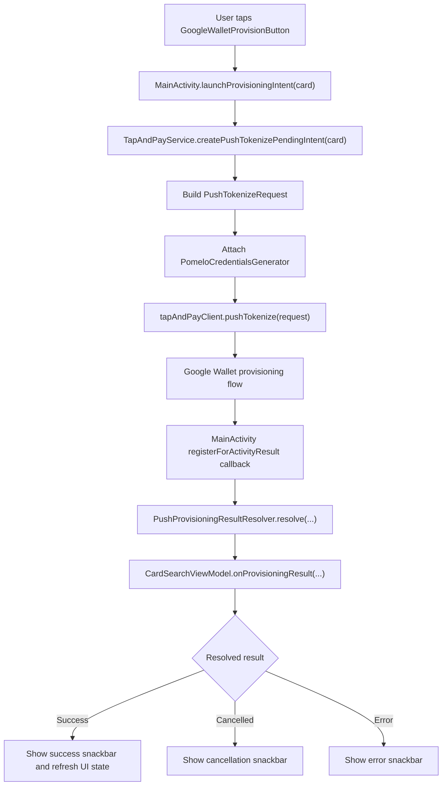
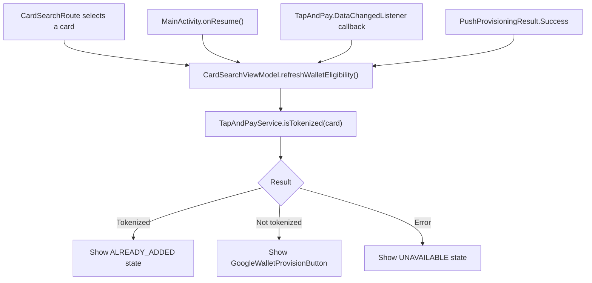

# Example Google UPP Android app

> [!IMPORTANT]
> This repository contains a basic example of a Google Tap And Pay SDK integration.
> Use it as a reference sample only, and always validate the implementation details against the official documentation provided by Google.
> Under no circumstances should the code in this repository be used in production.

This folder contains an Android sample app that demonstrates a Google Tap And Pay Push Provisioning integration. The focus is the client app flow: rendering the official Google Wallet button, checking tokenization state, launching `pushTokenize(...)`, generating Pomelo credentials, and resolving the result returned by Google Wallet.

## Key pieces

### GoogleWalletProvisionButton

[GoogleWalletProvisionButton.kt](app/src/main/java/com/example/example_google_upp/components/GoogleWalletProvisionButton.kt) is the Compose entry point for rendering the official "Add to Google Wallet" button.

The app uses the Provision Button API with programmatic integration through `ProvisionButton`. This avoids maintaining static button assets and lets the SDK own branding, localization, and scaling. The API supports two display modes: `PROVISION_BUTTON_DISPLAY_MODE_PRIMARY` and `PROVISION_BUTTON_DISPLAY_MODE_CONDENSED`; this sample uses `PRIMARY`.

Official reference: [Provision Button API](https://developers.google.com/pay/issuers/apis/push-provisioning/android/provision-button-api)

### MainActivity

[MainActivity.kt](app/src/main/java/com/example/example_google_upp/MainActivity.kt) connects the Compose UI with the Tap And Pay flow. Its responsibilities are:

- Register `registerForActivityResult(...)` to listen for the Google Wallet Activity result.
- Register `TapAndPay.DataChangedListener` to refresh local state when Wallet changes.
- Revalidate eligibility in `onResume`, because Wallet state can change outside the app.
- Request the push tokenization `PendingIntent` and launch it with `IntentSenderRequest`.
- Delegate result interpretation to `PushProvisioningResultResolver`.

Official references:

- [Handling result callbacks](https://developers.google.com/pay/issuers/apis/push-provisioning/android/wallet-operations#handling_result_callbacks)
- [Data Change Callbacks](https://developers.google.com/pay/issuers/apis/push-provisioning/android/reading-wallet#data_change_callbacks)

### CardSearchViewModel.refreshWalletEligibility

[CardSearchViewModel.kt](app/src/main/java/com/example/example_google_upp/ui/CardSearchViewModel.kt) owns the UI state for the selected card.

`refreshWalletEligibility()` synchronizes the Google Wallet button state. It is called after Wallet-relevant events such as `onResume`, `DataChangedListener` callbacks, and successful provisioning. The function cancels any previous check, calls `walletProvisioningGateway.isTokenized(card)`, and maps the result to the UI:

- `isTokenized == true` -> `WalletButtonState.ALREADY_ADDED`
- `isTokenized == false` -> `WalletButtonState.READY_TO_ADD`
- error while checking Tap And Pay -> `WalletButtonState.UNAVAILABLE`

Tap And Pay documentation recommends updating the UI when the Activity returns to the foreground and when a data-change callback arrives.

### TapAndPayService

[TapAndPayService.kt](app/src/main/java/com/example/example_google_upp/wallet/TapAndPayService.kt) is the app gateway to `TapAndPayClient` and the issuer backend.

`isTokenized(card)` builds an `IsTokenizedRequest` with the card's last four digits, network, and token service provider. It returns `true` or `false` depending on whether Tap And Pay finds that card tokenized in the current device's Google Wallet.

Official reference: [isTokenized](https://developers.google.com/pay/issuers/apis/push-provisioning/android/reading-wallet#istokenized)

`createPushTokenizePendingIntent(card)` fetches the user from `BackendService`, builds the `UserAddress`, builds the `PushTokenizeRequest`, and calls `tapAndPayClient.pushTokenize(request)`. The request passes `PomeloCredentialsGenerator` as the `PaymentCredentialsGenerator`, which is the component Google Wallet invokes when it needs OPC credentials.

Official reference: [pushTokenize](https://developers.google.com/pay/issuers/apis/push-provisioning/android/wallet-operations#pushtokenize)

### PomeloCredentialsGenerator

[PomeloCredentialsGenerator.kt](app/src/main/java/com/example/example_google_upp/wallet/PomeloCredentialsGenerator.kt) implements Tap And Pay's `PaymentCredentialsGenerator` interface.

Its responsibility is to generate issuer credentials when Google Wallet reaches the push tokenization step that requires OPC data. The `generate(request)` method receives a `GeneratePaymentCredentialsRequest` with Google-provided context:

- `serverSessionId`
- `stableHardwareId`
- `walletId`

The app sends those values to Pomelo through `BackendService.getProvisioningData(...)` and uses the response to build a `GeneratePaymentCredentialsResponse` with:

- `setOpaquePaymentCard(...)`
- `setGoogleOpaquePaymentCard(...)`

The implementation returns a `Future<GeneratePaymentCredentialsResponse>`, as expected by the SDK interface.

Official references:

- [PaymentCredentialsGenerator interface](https://developers.google.com/pay/issuers/apis/push-provisioning/android/wallet-operations#paymentcredentialsgenerator_interface)
- [GeneratePaymentCredentialsRequest interface](https://developers.google.com/pay/issuers/apis/push-provisioning/android/wallet-operations#generatepaymentcredentialsrequest_interface)
- [GeneratePaymentCredentialsResponse interface](https://developers.google.com/pay/issuers/apis/push-provisioning/android/wallet-operations#generatepaymentcredentialsresponse_interface)

### PushProvisioningResultResolver

[PushProvisioningResultResolver.kt](app/src/main/java/com/example/example_google_upp/wallet/PushProvisioningResultResolver.kt) translates the Google Wallet result into the internal `PushProvisioningResult` model.

`MainActivity` delegates the `activityResultCode` and `Intent` received from Google Wallet to this resolver. The resolver reads `TapAndPay.EXTRA_PUSH_TOKENIZE_RESULT` when available and returns one of three simple results so the `ViewModel` can update the UI:

- `Success`: tokenization succeeded.
- `Cancelled`: Tap And Pay returned a cancellation status, such as `TAP_AND_PAY_USER_CANCELED_FLOW` or `CANCELED`.
- `Error`: the Tap And Pay payload is missing, tokenization outcomes are missing, FPAN save failed, or any other error status was returned.

This handler is intentionally basic for the sample app: it does not try to model advanced UI for every error code, it only distinguishes success, cancellation, and error.

Official reference: [Sample code for pushTokenize(...)](https://developers.google.com/pay/issuers/apis/push-provisioning/android/upgrade_to_upp#sample_code_for_pushtokenize)

## SDK references used by the app

- [Provision Button API](https://developers.google.com/pay/issuers/apis/push-provisioning/android/provision-button-api)
- [isTokenized](https://developers.google.com/pay/issuers/apis/push-provisioning/android/reading-wallet#istokenized)
- [Data Change Callbacks](https://developers.google.com/pay/issuers/apis/push-provisioning/android/reading-wallet#data_change_callbacks)
- [pushTokenize](https://developers.google.com/pay/issuers/apis/push-provisioning/android/wallet-operations#pushtokenize)
- [Handling result callbacks](https://developers.google.com/pay/issuers/apis/push-provisioning/android/wallet-operations#handling_result_callbacks)
- [PaymentCredentialsGenerator interface](https://developers.google.com/pay/issuers/apis/push-provisioning/android/wallet-operations#paymentcredentialsgenerator_interface)
- [GeneratePaymentCredentialsRequest interface](https://developers.google.com/pay/issuers/apis/push-provisioning/android/wallet-operations#generatepaymentcredentialsrequest_interface)
- [GeneratePaymentCredentialsResponse interface](https://developers.google.com/pay/issuers/apis/push-provisioning/android/wallet-operations#generatepaymentcredentialsresponse_interface)
- [Sample code for pushTokenize(...)](https://developers.google.com/pay/issuers/apis/push-provisioning/android/upgrade_to_upp#sample_code_for_pushtokenize)
