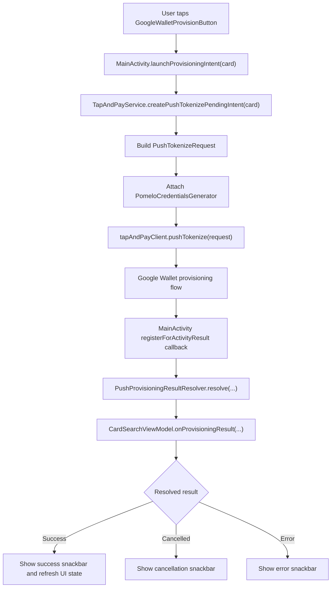
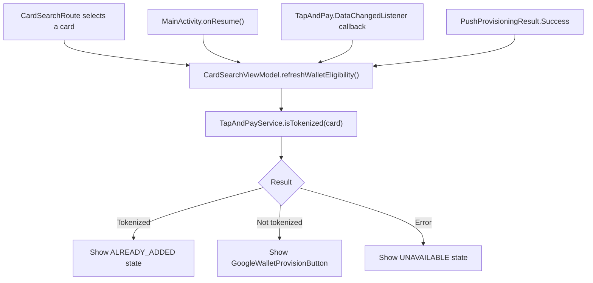

# Ejemplo de app Android con Google UPP

> [!IMPORTANT]
> Este repositorio contiene un ejemplo basico de una integracion con Google Tap And Pay SDK.
> Usalo solo como muestra de referencia y valida siempre los detalles de implementacion con la documentacion oficial provista por Google.
> Bajo ninguna circunstancia deberia usarse el codigo de este repositorio en produccion.

Esta carpeta contiene una app Android de ejemplo que demuestra una integracion con Google Tap And Pay Push Provisioning. El foco esta en el flujo de la app cliente: renderizar el boton oficial de Google Wallet, verificar el estado de tokenizacion, lanzar `pushTokenize(...)`, generar credenciales de Pomelo y resolver el resultado devuelto por Google Wallet.

## Piezas clave

### GoogleWalletProvisionButton

[GoogleWalletProvisionButton.kt](app/src/main/java/com/example/example_google_upp/components/GoogleWalletProvisionButton.kt) es el punto de entrada en Compose para renderizar el boton oficial "Add to Google Wallet".

La app usa la Provision Button API con integracion programatica mediante `ProvisionButton`. Esto evita mantener assets estaticos del boton y le permite al SDK encargarse del branding, la localizacion y el escalado. La API soporta dos modos de visualizacion: `PROVISION_BUTTON_DISPLAY_MODE_PRIMARY` y `PROVISION_BUTTON_DISPLAY_MODE_CONDENSED`; este ejemplo usa `PRIMARY`.

Referencia oficial: [Provision Button API](https://developers.google.com/pay/issuers/apis/push-provisioning/android/provision-button-api)

### MainActivity

[MainActivity.kt](app/src/main/java/com/example/example_google_upp/MainActivity.kt) conecta la UI de Compose con el flujo de Tap And Pay. Sus responsabilidades son:

- Registrar `registerForActivityResult(...)` para escuchar el resultado de la Activity de Google Wallet.
- Registrar `TapAndPay.DataChangedListener` para refrescar el estado local cuando cambia Wallet.
- Revalidar elegibilidad en `onResume`, porque el estado de Wallet puede cambiar fuera de la app.
- Solicitar el `PendingIntent` de push tokenization y lanzarlo con `IntentSenderRequest`.
- Delegar la interpretacion del resultado en `PushProvisioningResultResolver`.

Referencias oficiales:

- [Handling result callbacks](https://developers.google.com/pay/issuers/apis/push-provisioning/android/wallet-operations#handling_result_callbacks)
- [Data Change Callbacks](https://developers.google.com/pay/issuers/apis/push-provisioning/android/reading-wallet#data_change_callbacks)

### CardSearchViewModel.refreshWalletEligibility

[CardSearchViewModel.kt](app/src/main/java/com/example/example_google_upp/ui/CardSearchViewModel.kt) maneja el estado de UI de la tarjeta seleccionada.

`refreshWalletEligibility()` sincroniza el estado del boton de Google Wallet. Se llama despues de eventos relevantes para Wallet como `onResume`, los callbacks de `DataChangedListener` y un provisioning exitoso. La funcion cancela cualquier verificacion previa, llama a `walletProvisioningGateway.isTokenized(card)` y mapea el resultado a la UI:

- `isTokenized == true` -> `WalletButtonState.ALREADY_ADDED`
- `isTokenized == false` -> `WalletButtonState.READY_TO_ADD`
- error al verificar Tap And Pay -> `WalletButtonState.UNAVAILABLE`

La documentacion de Tap And Pay recomienda actualizar la UI cuando la Activity vuelve al foreground y cuando llega un callback de cambio de datos.

### TapAndPayService

[TapAndPayService.kt](app/src/main/java/com/example/example_google_upp/wallet/TapAndPayService.kt) es la puerta de entrada de la app hacia `TapAndPayClient` y el backend emisor.

`isTokenized(card)` construye un `IsTokenizedRequest` con los ultimos cuatro digitos de la tarjeta, la red y el token service provider. Devuelve `true` o `false` segun si Tap And Pay encuentra esa tarjeta tokenizada en Google Wallet del dispositivo actual.

Referencia oficial: [isTokenized](https://developers.google.com/pay/issuers/apis/push-provisioning/android/reading-wallet#istokenized)

`createPushTokenizePendingIntent(card)` obtiene el usuario desde `BackendService`, construye `UserAddress`, arma el `PushTokenizeRequest` y llama a `tapAndPayClient.pushTokenize(request)`. La solicitud pasa `PomeloCredentialsGenerator` como `PaymentCredentialsGenerator`, que es el componente que Google Wallet invoca cuando necesita credenciales OPC.

Referencia oficial: [pushTokenize](https://developers.google.com/pay/issuers/apis/push-provisioning/android/wallet-operations#pushtokenize)

### PomeloCredentialsGenerator

[PomeloCredentialsGenerator.kt](app/src/main/java/com/example/example_google_upp/wallet/PomeloCredentialsGenerator.kt) implementa la interfaz `PaymentCredentialsGenerator` de Tap And Pay.

Su responsabilidad es generar credenciales del emisor cuando Google Wallet llega al paso de push tokenization que requiere datos OPC. El metodo `generate(request)` recibe un `GeneratePaymentCredentialsRequest` con contexto provisto por Google:

- `serverSessionId`
- `stableHardwareId`
- `walletId`

La app envia esos valores a Pomelo mediante `BackendService.getProvisioningData(...)` y usa la respuesta para construir un `GeneratePaymentCredentialsResponse` con:

- `setOpaquePaymentCard(...)`
- `setGoogleOpaquePaymentCard(...)`

La implementacion devuelve un `Future<GeneratePaymentCredentialsResponse>`, tal como espera la interfaz del SDK.

Referencias oficiales:

- [PaymentCredentialsGenerator interface](https://developers.google.com/pay/issuers/apis/push-provisioning/android/wallet-operations#paymentcredentialsgenerator_interface)
- [GeneratePaymentCredentialsRequest interface](https://developers.google.com/pay/issuers/apis/push-provisioning/android/wallet-operations#generatepaymentcredentialsrequest_interface)
- [GeneratePaymentCredentialsResponse interface](https://developers.google.com/pay/issuers/apis/push-provisioning/android/wallet-operations#generatepaymentcredentialsresponse_interface)

### PushProvisioningResultResolver

[PushProvisioningResultResolver.kt](app/src/main/java/com/example/example_google_upp/wallet/PushProvisioningResultResolver.kt) traduce el resultado de Google Wallet al modelo interno `PushProvisioningResult`.

`MainActivity` delega en este resolver el `activityResultCode` y el `Intent` recibidos desde Google Wallet. El resolver lee `TapAndPay.EXTRA_PUSH_TOKENIZE_RESULT` cuando esta disponible y devuelve uno de tres resultados simples para que el `ViewModel` actualice la UI:

- `Success`: la tokenizacion fue exitosa.
- `Cancelled`: Tap And Pay devolvio un estado de cancelacion, como `TAP_AND_PAY_USER_CANCELED_FLOW` o `CANCELED`.
- `Error`: falta el payload de Tap And Pay, faltan los resultados de tokenizacion, fallo el guardado de FPAN o se devolvio cualquier otro estado de error.

Este handler es intencionalmente basico para la app de ejemplo: no intenta modelar una UI avanzada para cada codigo de error, solo distingue entre exito, cancelacion y error.

Referencia oficial: [Sample code for pushTokenize(...)](https://developers.google.com/pay/issuers/apis/push-provisioning/android/upgrade_to_upp#sample_code_for_pushtokenize)

## Referencias del SDK usadas por la app

- [Provision Button API](https://developers.google.com/pay/issuers/apis/push-provisioning/android/provision-button-api)
- [isTokenized](https://developers.google.com/pay/issuers/apis/push-provisioning/android/reading-wallet#istokenized)
- [Data Change Callbacks](https://developers.google.com/pay/issuers/apis/push-provisioning/android/reading-wallet#data_change_callbacks)
- [pushTokenize](https://developers.google.com/pay/issuers/apis/push-provisioning/android/wallet-operations#pushtokenize)
- [Handling result callbacks](https://developers.google.com/pay/issuers/apis/push-provisioning/android/wallet-operations#handling_result_callbacks)
- [PaymentCredentialsGenerator interface](https://developers.google.com/pay/issuers/apis/push-provisioning/android/wallet-operations#paymentcredentialsgenerator_interface)
- [GeneratePaymentCredentialsRequest interface](https://developers.google.com/pay/issuers/apis/push-provisioning/android/wallet-operations#generatepaymentcredentialsrequest_interface)
- [GeneratePaymentCredentialsResponse interface](https://developers.google.com/pay/issuers/apis/push-provisioning/android/wallet-operations#generatepaymentcredentialsresponse_interface)
- [Sample code for pushTokenize(...)](https://developers.google.com/pay/issuers/apis/push-provisioning/android/upgrade_to_upp#sample_code_for_pushtokenize)
