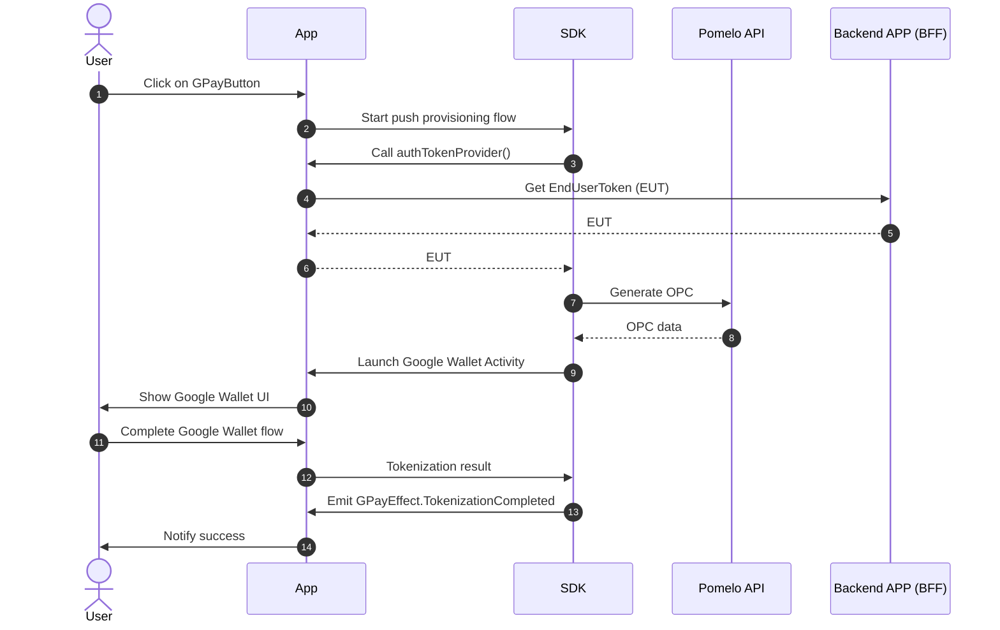
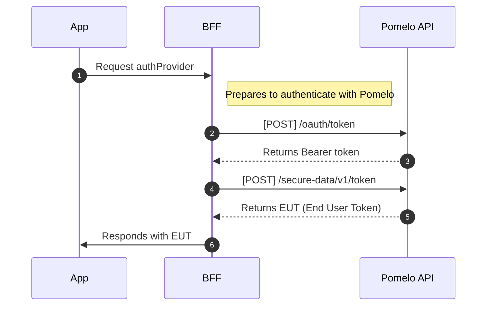

# Pomelo SDK: Push Provisioning

El módulo **pushprovisioning** es una biblioteca de Android SDK desarrollada por Pomelo que permite integrar la funcionalidad de **Push Provisioning** de Google Pay en aplicaciones Android.

Construido sobre el **Google Pay TapAndPay SDK**, ofrece **UI Components** pre-diseñados para Jetpack Compose que facilitan la integración. El módulo incluye **soporte multi-red** para Visa y Mastercard, proporcionando una experiencia de usuario fluida y segura para la tokenización
automática de tarjetas.

<div align="center">
<video src="https://github.com/user-attachments/assets/b058c0a0-1e81-4f65-830e-f7af2a644694" height="100" controls></video>
</div>

## Requisitos

- **Android SDK mínimo**: 23 (Android 6.0 Marshmallow)
- **Android SDK Target**: 34 (Android 14)
- **SDK Compile**: 35 (Android 15)
- **Kotlin**: Compatible con versión 2.0.20+
- **Gradle**: Versión 8.6+
- **Java Version**: 1.8
- **Jetpack Compose BOM**: 2024.09.00+

> [!WARNING]
> Este SDK fue desarrollado exclusivamente para Android nativo y no ha sido testeado en frameworks híbridos como Flutter o React Native. Para esos entornos, recomendamos integrar [TapAndPay](https://developers.google.com/pay/issuers/apis/push-provisioning/android) directamente en lugar de utilizar este SDK.

### Permisos Requeridos


```xml
<uses-permission android:name="android.permission.INTERNET" />
<uses-permission android:name="android.permission.ACCESS_NETWORK_STATE" />
```


## Instalación y uso básico

> [!WARNING]
> Antes de realizar cualquier integración en su app, es necesario completar el proceso de alta con Google. Puede leer más información en [Pomelo Docs](https://docs.pomelo.la/docs/cards/features/tokenization/google-pay/) y  [Push Provisioning API Access](https://developers.google.com/pay/issuers/apis/push-provisioning/android/allowlist) de Google. Si no se realiza correctamente este proceso, al inicializar el SDK obtendrán un error `15009` - `TAP_AND_PAY_UNAVAILABLE`


### Resolución de dependencias


Descargue el SDK de TapAndPay ([Guia](https://developers.google.com/pay/issuers/apis/push-provisioning/android/setup)) y el SDK de Pomelo y descomprima ambos dentro del un mismo directorio. Por ejemplo dentro de `${rootDir}/app/libs/`.


1. Agregue la configuración para que Maven pueda resolver las dependencias correctamente.

```groovy
dependencyResolutionManagement {
    repositoriesMode.set(RepositoriesMode.FAIL_ON_PROJECT_REPOS)
    repositories {
        maven { url "file://${rootDir}/app/libs/" }
        google()
        mavenCentral()

    }
}
```

2. Declare las dependencias.

```groovy
dependencies {
  implementation 'com.google.android.gms:play-services-tapandpay:18.8.0'
  implementation 'com.pomelo:push-provisioning:2.0.0'
}
```


### Crear la instancia del SDK

Declará la instancia directamente como propiedad de la `Activity`:

```kotlin
import com.pomelo.sdk.pushprovisioning.PomeloPushProvisioning
import com.pomelo.sdk.pushprovisioning.PomeloEnvironment
import com.pomelo.sdk.pushprovisioning.PomeloLogLevel

class MainActivity : ComponentActivity() {
    private val pushProvisioning = PomeloPushProvisioning(
        environment = PomeloEnvironment.PRODUCTION,
        logLevel = PomeloLogLevel.NONE,
    )

    override fun onCreate(savedInstanceState: Bundle?) {
        super.onCreate(savedInstanceState)
        setContent {
            MyCardScreen(pushProvisioning = pushProvisioning)
        }
    }
}
```

> [!NOTE]
> Si tu app tiene múltiples Activities que necesitan compartir la misma instancia, podés declararla en tu clase `Application` para evitar reinicializar el cliente HTTP en cada Activity.

### Implementar Autenticación


```kotlin
class AuthTokenProvider {
  suspend fun getToken(): String {
    return try {
      // Llamar a tu API para obtener el End User Token
      authApiService.getAuthToken().token
    } catch (e: Exception) {
      throw AuthenticationException("Error obteniendo token: ${e.message}")
    }
  }
}
```


### Integrar el Composable

> [!WARNING]
> Cada `GoogleWalletButtonComposable` registra su propio listener de cambios de Google Wallet
> para mantener su estado sincronizado. Lo ideal es usar un único composable por
> pantalla/Activity. Montar muchas instancias (por ejemplo, un ítem en una lista
> larga) multiplica los listeners registrados innecesariamente.

```kotlin
import com.pomelo.sdk.pushprovisioning.PomeloPushProvisioning
import com.pomelo.sdk.pushprovisioning.model.Brand
import com.pomelo.sdk.pushprovisioning.model.GWalletEffect
import com.pomelo.sdk.pushprovisioning.model.PushProvisioningCard
import com.pomelo.sdk.pushprovisioning.ui.GoogleWalletButtonComposable

@Composable
fun MyCardScreen(
  pushProvisioning: PomeloPushProvisioning,
  viewModel: HomeViewModel = viewModel()
) {
  Column(modifier = Modifier.padding(16.dp)) {
    GoogleWalletButtonComposable(
      pushProvisioning = pushProvisioning,
      card = PushProvisioningCard(
        cardId = "crd-123",
        lastFour = "1234",
        brand = Brand.VISA,
      ),
      accessTokenProvider = { viewModel.getAuthToken("usr-123") },
      onEffect = { effect ->
        when (effect) {
          GWalletEffect.Loading -> showLoading()
          GWalletEffect.TokenizationCompleted ->
            showSuccessSnackbar("¡Tarjeta agregada exitosamente a Google Wallet!")
          GWalletEffect.TokenizationCancelled ->
            showInfoSnackbar("Usuario canceló la operación")
          is GWalletEffect.Error -> showErrorSnackbar(effect.error.name)
        }
      },
      asBadge = false,
    )
  }
}
```

## Documentación de API



### 1. Inicialización

#### `PomeloPushProvisioning`

```kotlin
import com.pomelo.sdk.pushprovisioning.PomeloPushProvisioning
import com.pomelo.sdk.pushprovisioning.PomeloEnvironment
import com.pomelo.sdk.pushprovisioning.PomeloLogLevel

val pushProvisioning = PomeloPushProvisioning(
    environment = PomeloEnvironment.PRODUCTION,
    logLevel = PomeloLogLevel.NONE,
)
```

| Parámetro     | Tipo                | Requerido | Default                        | Descripción                           |
| ------------- | ------------------- | --------- | ------------------------------ | ------------------------------------- |
| `environment` | `PomeloEnvironment` | ❌         | `PomeloEnvironment.PRODUCTION` | Ambiente del API (STAGE o PRODUCTION) |
| `logLevel`    | `PomeloLogLevel`    | ❌         | `PomeloLogLevel.NONE`          | Nivel de logs del SDK y HTTP          |


#### `PomeloEnvironment`

| Valor                          | URL                          |
| ------------------------------ | ---------------------------- |
| `PomeloEnvironment.STAGE`      | https://api-stage.pomelo.la/ |
| `PomeloEnvironment.PRODUCTION` | https://api.pomelo.la/       |


#### `PomeloLogLevel`

Controla qué información loggea el SDK y su cliente HTTP.

| Valor   | Descripción                                     |
| ------- | ----------------------------------------------- |
| `NONE`  | Sin logs (default, recomendado en producción)   |
| `ERROR` | Solo errores                                    |
| `WARN`  | Errores y advertencias                          |
| `DEBUG` | Información de flujo sin cuerpo HTTP            |
| `BODY`  | Todo, incluyendo headers y body de cada request |

> [!CAUTION]
> Nunca uses `BODY` o `DEBUG` en producción — pueden exponer información sensible.

---

### 2. Composable Principal: `GoogleWalletButtonComposable`

#### Firma y parámetros

```kotlin
import com.pomelo.sdk.pushprovisioning.ui.GoogleWalletButtonComposable

fun GoogleWalletButtonComposable(
    pushProvisioning: PomeloPushProvisioning,
    card: PushProvisioningCard,
    accessTokenProvider: suspend () -> String,
    asBadge: Boolean = false,
    onEffect: (GWalletEffect) -> Unit = {},
    alreadyInWalletComposable: (@Composable () -> Unit)? = null,
)
```

| Parámetro                   | Tipo                        | Requerido | Default | Descripción                                                                         |
| --------------------------- | --------------------------- | --------- | ------- | ----------------------------------------------------------------------------------- |
| `pushProvisioning`          | `PomeloPushProvisioning`    | ✅         | -       | Instancia del SDK                                                                   |
| `card`                      | `PushProvisioningCard`      | ✅         | -       | Datos de la tarjeta a tokenizar                                                     |
| `accessTokenProvider`       | `suspend () -> String`      | ✅         | -       | Función suspendida que retorna el End User Token                                    |
| `asBadge`                   | `Boolean`                   | ❌         | `false` | `true` para mostrar como badge pequeño, `false` para botón completo                |
| `onEffect`                  | `(GWalletEffect) -> Unit`   | ❌         | `{}`    | Callback para recibir eventos del flujo (ver `GWalletEffect`)                      |
| `alreadyInWalletComposable` | `(@Composable () -> Unit)?` | ❌         | `null`  | UI personalizada cuando la tarjeta ya está en la wallet. `null` usa `AlreadyInWallet()` por defecto |


#### `PushProvisioningCard`

Datos de la tarjeta a tokenizar.

```kotlin
import com.pomelo.sdk.pushprovisioning.model.PushProvisioningCard
import com.pomelo.sdk.pushprovisioning.model.Brand

PushProvisioningCard(
    cardId = "crd-123",
    lastFour = "1234",
    brand = Brand.VISA,
)
```

| Campo      | Tipo     | Descripción                                      |
| ---------- | -------- | ------------------------------------------------ |
| `cardId`   | `String` | Identificador de la tarjeta en el sistema Pomelo |
| `lastFour` | `String` | Últimos 4 dígitos del PAN                        |
| `brand`    | `Brand`  | Red de la tarjeta (`VISA` o `MASTERCARD`)        |


#### `Brand`

```kotlin
import com.pomelo.sdk.pushprovisioning.model.Brand

enum class Brand { VISA, MASTERCARD }
```


#### `AlreadyInWallet`

Composable por defecto que muestra el estado "ya tokenizada". Se puede reemplazar pasando un composable propio en `alreadyInWalletComposable`.

```kotlin
import com.pomelo.sdk.pushprovisioning.ui.AlreadyInWallet

GoogleWalletButtonComposable(
    pushProvisioning = pushProvisioning,
    card = card,
    accessTokenProvider = accessTokenProvider,
    alreadyInWalletComposable = {
        Text("Ya está en tu billetera")
    },
)
```

---

### 3. Eventos: `GWalletEffect`

Eventos emitidos por el composable vía `onEffect`.

```kotlin
import com.pomelo.sdk.pushprovisioning.model.GWalletEffect

sealed class GWalletEffect {
    object Loading : GWalletEffect()
    object TokenizationCompleted : GWalletEffect()
    object TokenizationCancelled : GWalletEffect()
    data class Error(
        val error: PushProvisioningError,
        val tapAndPayStatusCode: Int? = null,
    ) : GWalletEffect()
}
```

| Caso                    | Descripción                                                                                                                   |
| ----------------------- | ----------------------------------------------------------------------------------------------------------------------------- |
| `Loading`               | El flujo de tokenización comenzó                                                                                              |
| `TokenizationCompleted` | La tarjeta fue agregada exitosamente a Google Wallet                                                                          |
| `TokenizationCancelled` | El usuario canceló el flujo en Google Wallet                                                                                  |
| `Error`                 | Ocurrió un error. `error` indica la categoría; `tapAndPayStatusCode` es el código numérico de TapAndPay cuando está disponible |


#### `PushProvisioningError`

```kotlin
import com.pomelo.sdk.pushprovisioning.model.PushProvisioningError

enum class PushProvisioningError {
    AUTHENTICATION,
    WALLET_UNAVAILABLE,
    TOKENIZATION_FAILED,
}
```

| Valor                 | Descripción                                                            |
| --------------------- | ---------------------------------------------------------------------- |
| `AUTHENTICATION`      | Falló `accessTokenProvider` o el token retornado es inválido           |
| `WALLET_UNAVAILABLE`  | Google Wallet o TapAndPay no están disponibles en el dispositivo o app |
| `TOKENIZATION_FAILED` | El flujo de tokenización no se completó correctamente                  |


#### TapAndPay Status Codes

Valores posibles de `GWalletEffect.Error.tapAndPayStatusCode`:

| Código                                            | Valor | Descripción                                                                                          |
| ------------------------------------------------- | ----- | ---------------------------------------------------------------------------------------------------- |
| `TAP_AND_PAY_NO_ACTIVE_WALLET`                    | 15002 | No hay una wallet activa en el dispositivo                                                           |
| `TAP_AND_PAY_ATTESTATION_ERROR`                   | 15005 | La tokenización falló porque el dispositivo no pasó la verificación de compatibilidad                |
| `TAP_AND_PAY_UNAVAILABLE`                         | 15009 | La API de TapAndPay no puede ser llamada por esta app — verificá package name y fingerprint en la allowlist |
| `TAP_AND_PAY_SAVE_CARD_ERROR`                     | 15019 | Falló al guardar el FPAN como card on file                                                           |
| `TAP_AND_PAY_INELIGIBLE_FOR_TOKENIZATION`         | 15021 | La tarjeta no es elegible para tokenización                                                          |
| `TAP_AND_PAY_TOKENIZATION_DECLINED`               | 15022 | La tokenización fue rechazada por el TSP (red path)                                                  |
| `TAP_AND_PAY_TOKENIZE_ERROR`                      | 15024 | La API de TapAndPay no puede ser llamada por esta app                                                |
| `TAP_AND_PAY_TOKEN_ACTIVATION_REQUIRED`           | 15025 | El intento fue exitoso pero requiere verificación adicional (yellow path)                            |
| `TAP_AND_PAY_USER_CANCELED_FLOW`                  | 15027 | El usuario canceló el flujo intencionalmente                                                         |
| `TAP_AND_PAY_ENROLL_FOR_VIRTUAL_CARDS_FAILED`     | 15028 | Falló el intento de enrolamiento en Virtual Cards                                                    |
| `TAP_AND_PAY_SAVE_CARD_NOT_ATTEMPTED`             | 15030 | No se intentó guardar el FPAN como card on file                                                      |
| `TAP_AND_PAY_VIRTUAL_CARDS_ENROLLMENT_NOT_ATTEMPTED` | 15031 | No se intentó el enrolamiento en Virtual Cards                                                    |
| `TAP_AND_PAY_PAYMENT_CREDENTIALS_GENERATION_FAILED` | 15032 | El método `PaymentCredentialsGenerator.generate` falló al retornar las credenciales de pago        |
| `TAP_AND_PAY_INELIGIBLE_FOR_AUXILIARY_TOKENIZATION` | 15033 | La tarjeta no es elegible para tokenización auxiliar con el TSP auxiliar                           |
| `TAP_AND_PAY_AUXILIARY_TOKENIZATION_DECLINED`     | 15034 | El TSP auxiliar rechazó el pedido de tokenización auxiliar (red path)                               |

## Flujo de autenticación


Por motivos de seguridad, la generación del EUT (End User Token) debe realizarse en un servidor backend y no directamente en el dispositivo móvil. Esto evita exponer credenciales privadas en la
aplicación cliente.


El flujo de autenticación sigue estos pasos:

1. **La aplicación solicita autenticación**: Cuando el usuario intenta agregar una tarjeta a Google Wallet, la app solicita un token al BFF (Backend for Frontend)
2. **El BFF se autentica con Pomelo**: El servidor backend utiliza sus credenciales para obtener un Bearer token de la API de Pomelo
3. **Generación segura del EUT**: Con el Bearer token, el BFF solicita la generación del EUT, que contiene los datos cifrados necesarios para la tokenización
4. **Retorno seguro a la app**: El EUT se envía de forma segura a la aplicación móvil para completar el proceso de tokenización



### Logs y Debugging

Habilitá los logs configurando `logLevel` al crear la instancia (ver [`PomeloLogLevel`](#pomerologlevel)).

> [!TIP]
> Los logs del SDK de TapAndPay vienen ofuscados por defecto. Para desenofuscarlos, solicitá acceso a Google mediante el [formulario de acceso](https://developers.google.com/pay/issuers/apis/push-provisioning/android/support/troubleshooting#enable_logs_for_user).

El SDK emite logs bajo tags categorizados. Usá `-s` en ADB para filtrar por componente:

| Tag                       | Cuándo usarlo                              |
| ------------------------- | ------------------------------------------ |
| `PushProvisioning*`       | Ver todo                                   |
| `PushProvisioning:Flow`   | Debuggear el flujo de tokenización         |
| `PushProvisioning:HTTP`   | Inspeccionar requests/responses a Pomelo API |
| `PushProvisioning:UI`     | Rastrear cambios de estado del composable  |
| `PushProvisioning:TapPay` | Problemas con el SDK de Google             |

```bash
adb logcat -s "PushProvisioning*"
adb logcat -s "PushProvisioning:Flow" -s "PushProvisioning:HTTP"
```

## Troubleshooting

Antes de debuggear cualquier problema, asegurate de:

1. **Habilitar los logs del SDK** con `logLevel = PomeloLogLevel.BODY` (ver [`PomeloLogLevel`](#pomerologlevel)):
```kotlin
import com.pomelo.sdk.pushprovisioning.PomeloPushProvisioning
import com.pomelo.sdk.pushprovisioning.PomeloEnvironment
import com.pomelo.sdk.pushprovisioning.PomeloLogLevel

val pushProvisioning = PomeloPushProvisioning(
    environment = PomeloEnvironment.STAGE,
    logLevel = PomeloLogLevel.BODY,
)
```

2. **Desenofuscar los logs de TapAndPay**: por defecto vienen ofuscados. Solicitá acceso a Google mediante el [formulario de acceso](https://developers.google.com/pay/issuers/apis/push-provisioning/android/support/troubleshooting#enable_logs_for_user) para ver mensajes de error completos.

### El botón no aparece después de instalar el SDK (`15009` - `TAP_AND_PAY_UNAVAILABLE`)

La causa más probable es que la app no esté en la allowlist de Google para usar el SDK de TapAndPay. El código `15009` (`TAP_AND_PAY_UNAVAILABLE`) lo confirma. Buscalo en los logs:

```
PushProvisioning:UI    D  Refresh completed source=initial state=Unavailable brand=VISA lastFour=0317
PushProvisioning:Flow  W  Refresh failed result=Unavailable
                          com.google.android.gms.common.api.ApiException: 15009: Calling package not verified
```

**Solución**: Solicitá el acceso al TapAndPay SDK directamente con Google. Consultá la [documentación de Push Provisioning API Access](https://developers.google.com/pay/issuers/apis/push-provisioning/android/allowlist).

---

### Error durante el flujo (`15032` - `TAP_AND_PAY_PAYMENT_CREDENTIALS_GENERATION_FAILED`)

El flujo arranca, se lanza la Activity de Google Wallet, pero la tarjeta no queda tokenizada. En los logs vas a ver que la generación del OPC falló con un `401` antes de que Google Wallet pudiera procesar el request:

```
PushProvis...lGenerator  D  Generating OPC brand=VISA lastFour=5577
PushProvisioning:HTTP    D  --> POST https://api.pomelo.la/token-provisioning/v2/visa/google-pay
PushProvisioning:HTTP    D  Authorization: Bearer
PushProvisioning:HTTP    D  <-- 401 https://api.pomelo.la/token-provisioning/v2/visa/google-pay (498ms)
PushProvis...lGenerator  E  OPC generation failed brand=VISA
                             com.pomelo.sdk.pushprovisioning.pomelo.PomeloApiException: Pomelo API failed statusCode=401
PushProvisioning:TapPay  D  PushTokenizeResult cardResult=false cardStatus=15032 tokenResult=false tokenStatus=15032
PushProvisioning:UI      D  TapAndPay result=Error(tapAndPayStatusCode=15032)
```

**Solución**: El token retornado por `accessTokenProvider` es inválido o corresponde al ambiente equivocado. Verificá que el `PomeloEnvironment` configurado (STAGE vs PRODUCTION) coincida con el ambiente del token.

---

### El botón sigue apareciendo después de tokenizar la tarjeta

La tarjeta fue tokenizada exitosamente pero el SDK sigue mostrando el botón "Agregar a Google Wallet". Al verificar el estado, `listTokens` devuelve 0 elementos y el SDK interpreta que la tarjeta no está tokenizada:

```
PushProvisioning:TapPay  D  Token lookup completed found=false tokenCount=0 brand=VISA lastFour=1234
PushProvisioning:Flow    D  Refresh state result=ReadyToAdd brand=VISA lastFour=1234
PushProvisioning:UI      D  Refresh completed source=resume state=ReadyToAdd brand=VISA lastFour=1234
```

**Solución**: El problema más común es que el package name de la app esté mal cargado en los portales de Visa/Mastercard. Verificá que coincida exactamente con el `applicationId` del `build.gradle` — los package names son **case sensitive**, revisá mayúsculas y minúsculas. Si el valor es correcto y el problema persiste, contactá a Pomelo para revisarlo.

